[TOC]

## 文章大纲

作为一名程序员，随着工作年龄的增加，工作经验的丰富。日益发现编程基础知识的重要性，而不是像一些初级开发者一样，比较重视上层开发，不需要过多的关注一些底层开发。本文就是针对这样的情况而写的。
主要是针对大学计算机专业需要学习的一些知识作归纳与总结，分享一些高质量的书籍与视频网站。涉及到的书籍也可以通过，我的个人公众号进行领取，我个人的公众号是卡二条的技术圈，你只需要回复计算机书籍即可领取。

## 书籍大纲

下图就是整个书籍的大纲，后面推荐的书籍也是针对这个大纲进行，会涉及到对应的书籍和视频。总结下来基本就是计算机基础原理、操作系统、编程语言、计算机网络、数据库、算法与数据结构和信息安全这几个方面的知识点。
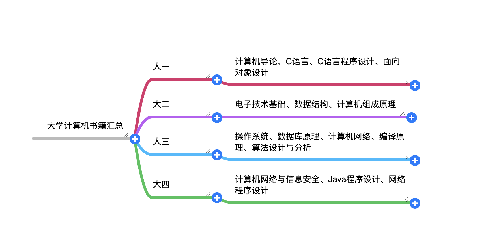

## 基础书籍

### C语言相关

1. C程序设计语言

该书比较简短，和《C++程序设计语言》相比，该书更加简练。同时也是适合有一定的实际经验的人，对于初学者来说，不是很合适。

2. C和指针

看书名，可能你会想到这是单独讲C语言中指针的相关东西，实则不是。它是一本全面的C语言入门书籍，本书的内容也需要有一定的C语言基础。书中包含的了ADT、递归、指针和数组等部分内容。
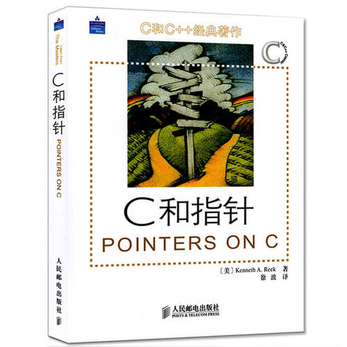

1. C primer plus

《C primer plus》这本书特别适合作为一个入门书籍。里面不仅仅有理论知识，同时也有很多的练习题。

### 网络相关

1. 计算机网络

说到计算机网络，首推的就是谢希仁的《计算机网络》。该书一直在更新出版，当前的最新版本是第七版。作者也是我过著名的计算机网络专家和教育家，因此从写作背景来说，含金量就不会低。全书分为9章，比较全面地介绍了计算机网络的发展与原理结构体系、物理层、数据链路层(包括局域网)、网络层、传输层、应用层、网络安全、互联网上的音视频服务，以及无线网络和移动网络等内容。同时各章节都配有相应的试题练习。
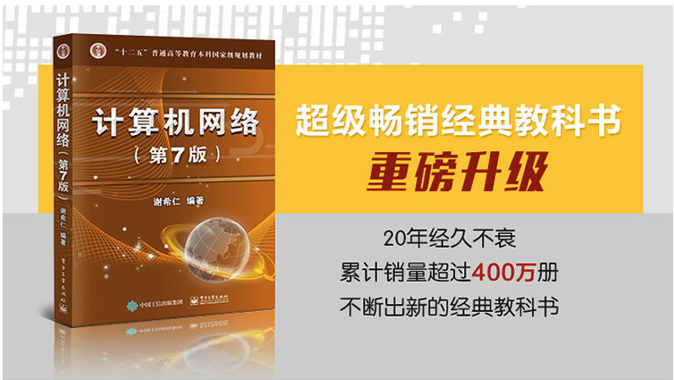

1. 计算机网络自定向下方法

本书是当前世界上最为流行的计算机网络教科书之一，采用了作者独创的自顶向下的方法来讲授计算机网络的原理及其协议，即从应用层协议开始沿协议栈向下讲解，强调应用层范例和应用编程接口，使读者尽快进入每天使用的应用程序环境之中进行学习和“创造”。本书的讲解以因特网为例，学以致用；注重教学法，深入浅出地重点讲解计算机网络的基本原理
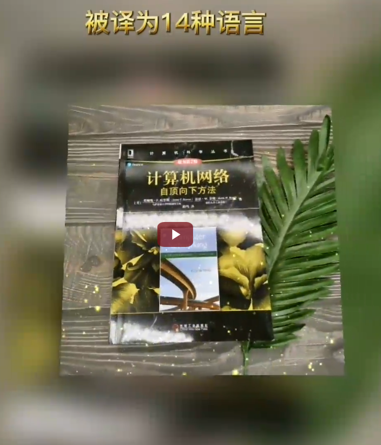

1. HTTP权威指南

上面两本书，更多的是针对整个网络相关的知识，很少对某一层的做一个细致全面的分析。在我们的实际开发中，可能针对应用层的网络协议使用的居多，例如http协议。HTTP权威指南就是一本全面分析与总结HTTP协议的一本书籍，是每一个程序员必看书籍。
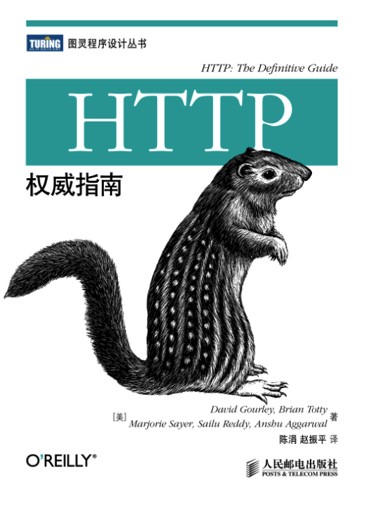

### 操作系统

1. UNIX环境高级编程

本书是被誉为UNIX编程“圣经”的Advanced Programming in the UNIX Environment一书的更新版。在本书第1版出版后的十几年中，UNIX行业已经有了巨大的变化，特别是影响UNIX编程接口的有关标准变化很大。本书在保持了前一版的风格的基础上，根据最新的标准对内容进行了修订和增补，反映了最新的技术发展。书中除了介绍UNIX文件和目录、标准I/O库、系统数据文件和信息、进程环境、进程控制、进程关系、信号、线程、线程控制、守护进程、各种I/O、进程间通信、网络IPC、伪终端等方面的内容，还在此基础上介绍了多个应用示例，包括如何创建数据库函数库以及如何与网络打印机通信等。此外，还在附录中给出了函数原型和部分习题的答案。
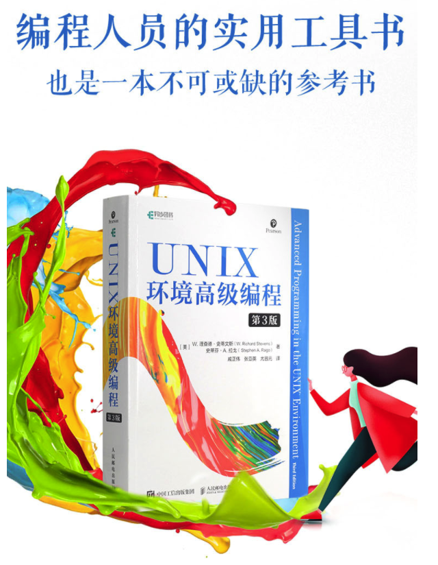

1. 现代操作系统

在《现代操作系统(英文版第3版)》第3版中，作者深入讨论了许多主题，包括：进程，线程，存储管理，文件系统，I/O死锁，接口设计，多媒体，性能权衡。以及有关操作系统设计的最新趋势。书中不仅涵盖了现代操作系统的原理和实践，而且特别关注了Linux操作系统，WindowsVista操作系统、嵌入式操作系统、实时操作系统以及多媒体操作系统。

### 计算机原理

1. 深入理解计算机系统

本书主要介绍了计算机系统的基本概念，包括最底层的内存中的数据表示、流水线指令的构成、虚拟存储器、编译系统、动态加载库，以及用户应用等。书中提供了大量实际操作，可以帮助读者更好地理解程序执行的方式，改进程序的执行效率。此书以程序员的视角全面讲解了计算机系统，深入浅出地介绍了处理器、编译器、操作系统和网络环境，是这一领域的权威之作。
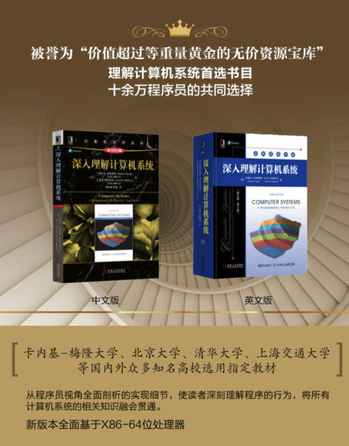

### 数据库

1. 高性能MySQL
《高性能MySQL(第2版)》包含14章和4个附录，内容覆盖MySQL系统架构、设计应用技巧、SQL语句优化、服务器性能调优、系统配置管理和安全设置、监控分析，以及复制、扩展和备份/还原等主题，每一章的内容自成体系，适合各领域技术人员作选择性的阅读。
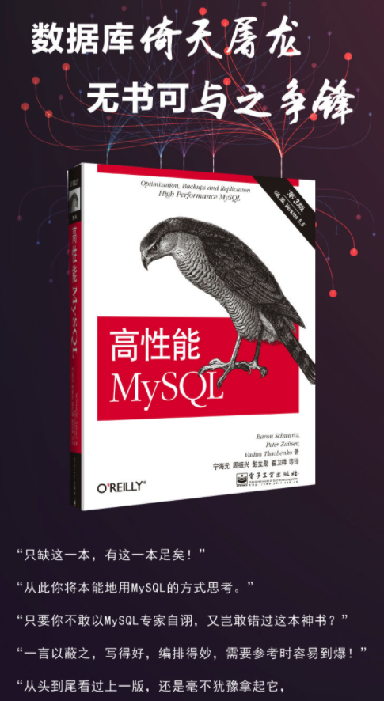

1. MySQL技术内幕InnoDB存储引擎

《MySQL技术内幕：InnoDB存储引擎》一共10章，首先宏观地介绍了MySQL的体系结构和各种常见的存储引擎以及它们之间的比较；接着以InnoDB的内部实现为切入点，逐一详细讲解了InnoDB存储引擎内部的各个功能模块的实现原理，包括InnoDB存储引擎的体系结构、内存中的数据结构、基于InnoDB存储引擎的表和页的物理存储、索引与算法、文件、锁、事务、备份与恢复，以及InnoDB的性能调优等重要的知识；最后对InnoDB存储引擎源代码的编译和调试做了介绍，对大家阅读和理解InnoDB的源代码有重要的指导意义。
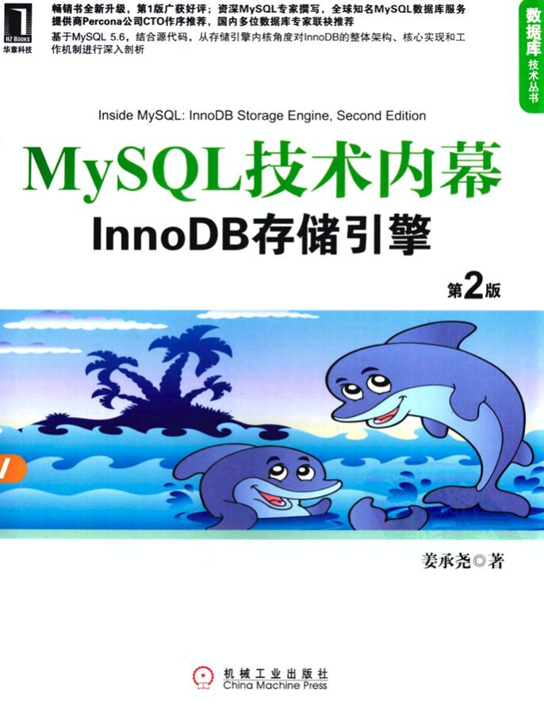

### 数据结构

1. 数据结构与算法分析

《数据结构与算法分析C++描述>（第3版）是数据结构和算法分析的经典教材，书中使用主流的程序设计语言C++作为具体的实现语言。书的内容包括表、栈、队列、树、散列表、优先队列、排序、不相交集算法、图论算法、算法分析、算法设计、摊还分析、查找树算法、k-d树和配对堆等。
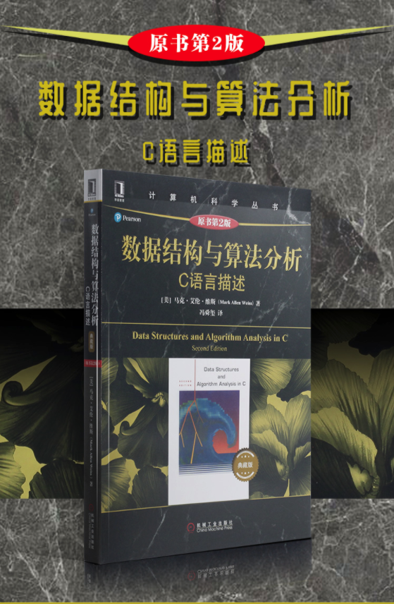

1. 数据结构(C语言版本)

《数据结构（C语言版）/清华大学计算机系列教材》的前半部分从抽象数据类型的角度讨论各种基本类型的数据结构及其应用；后半部分主要讨论查找和排序的各种实现方法及其综合分析比较。其内容和章节编排与1992年4月出版的《数据结构》（第二版）基本一致，但在《数据结构（C语言版）/清华大学计算机系列教材》中更突出了抽象数据类型的概念。全书采用类C语言作为数据结构和算法的描述语言。

### 算法

1. 算法导论

《算法导论（原书第3版）/计算机科学丛书》全书选材经典、内容丰富、结构合理、逻辑清晰，对本科生的数据结构课程和研究生的算法课程都是非常实用的教材，在IT专业人员的职业生涯中，《算法导论（原书第3版）/计算机科学丛书》也是一本案头必备的参考书或工程实践手册。

1. 算法导论

《算法导论》是国内知名的一个程序员大牛编写而成，全书采用漫画的形式讲解算法的原理、实现方式，让算法学习不再枯燥难懂，非常适合算法新手学习的一本书籍。
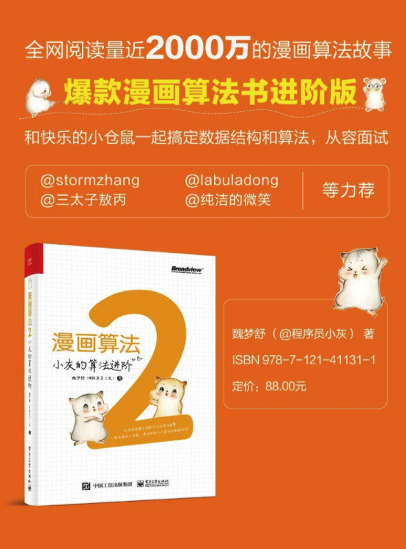

### Java

1. 廖雪峰Java教程

对于学习Java的开发者，非常推荐的一个教程类资源。由浅到深、实时演示的形式带你学习轻松学会Java编程。
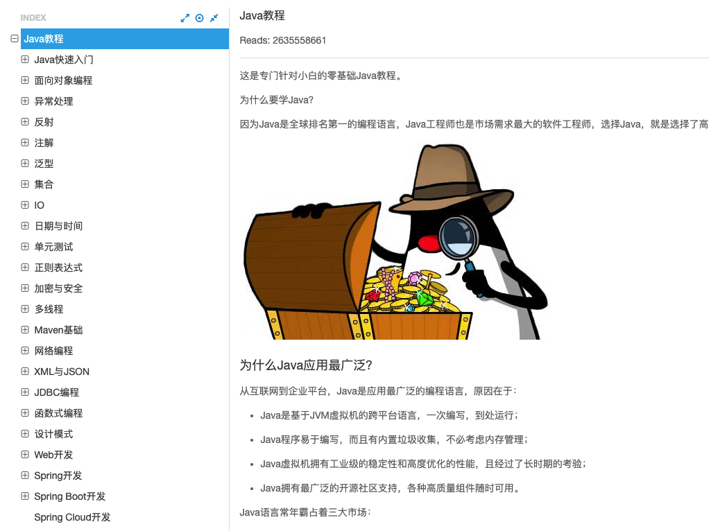

1. 韩顺平学Java

韩顺平老师就不用过多介绍了，相信很多同学学习编程都会看过韩老师的课程，韩老师讲课的最大亮点就是细致。这个课程是韩老师最新发布的Java教学课程，是一款深入学习Java编程知识的不二首选。
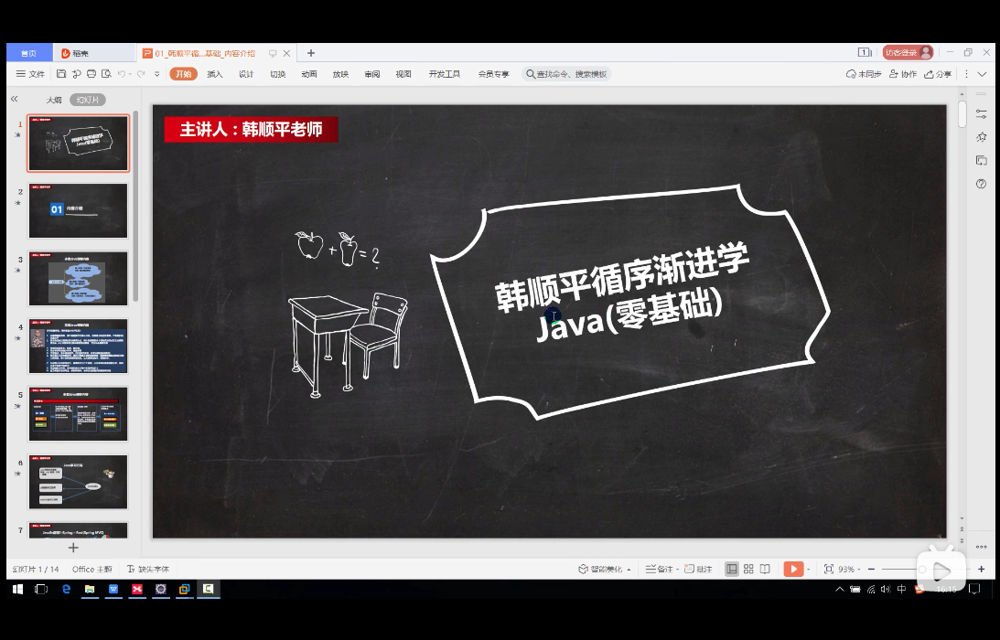

1. Java编程思想

上面分享了两个有关学习Java语法相关的知识，这里分享一本有关Java编程思想的书籍。《计算机科学丛书：Java编程思想（第4版）》获得的各项大奖以及来自世界各地的读者评论中，不难看出这是一本经典之作。本书的作者拥有多年教学经验，对C、C++以及Java语言都有独到、深入的见解，以通俗易懂及小而直接的示例解释了一个个晦涩抽象的概念。本书共22章，包括操作符、控制执行流程、访问权限控制、复用类、多态、接口、通过异常处理错误、字符串、泛型、数组、容器深入研究、JavaI/O系统、枚举类型、并发以及图形化用户界面等内容。这些丰富的内容，包含了Java语言基础语法以及高级特性，适合各个层次的Java程序员阅读，同时也是高等院校讲授面向对象程序设计语言以及Java语言的好教材和参考书。
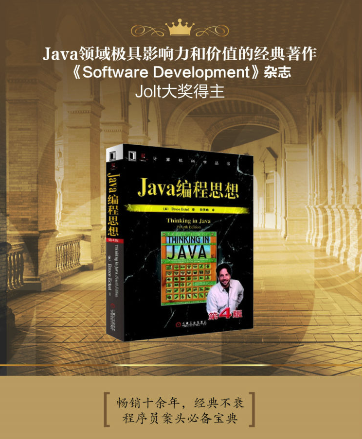
